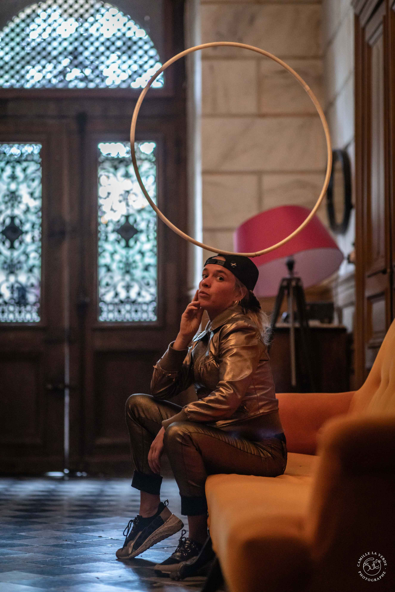
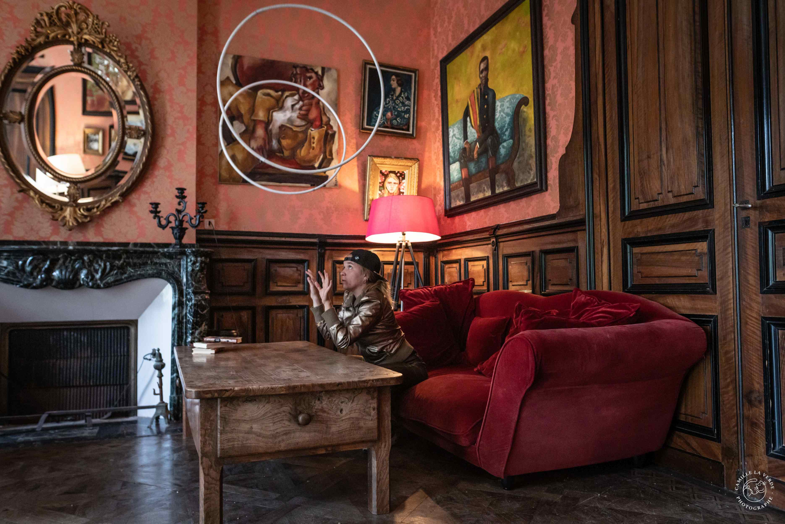
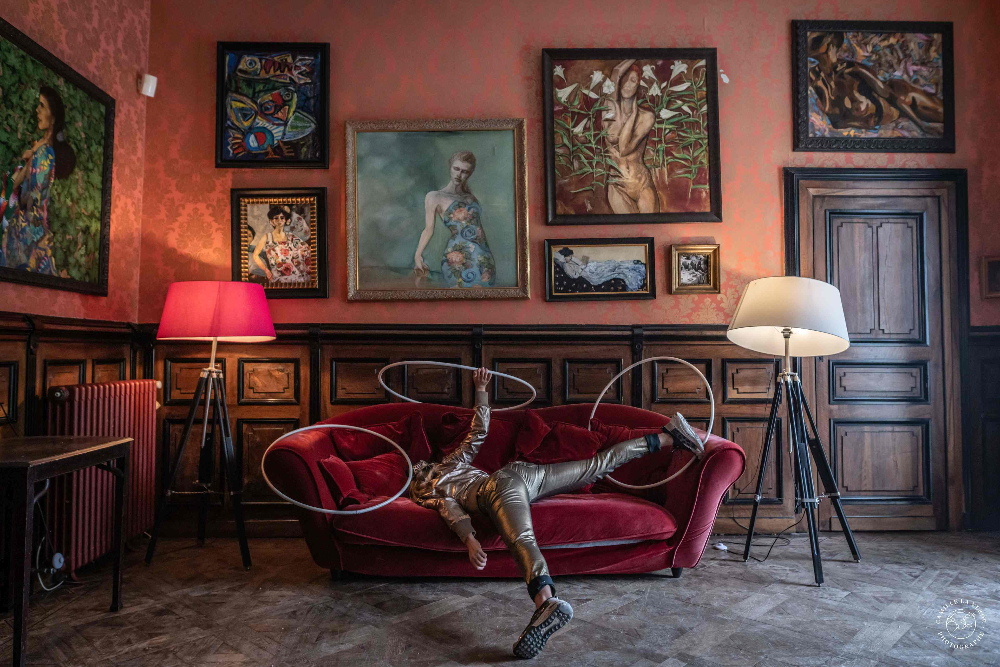

+++
startDate = 2023-11-13
endDate = 2023-11-19
title = "Hoop – Body – Space"
slug = "en workshop hoop body space"
description = "Workshop: Three day Hula-Hoop exploration journey with Perrine Budan."
summary = "Three days of hooping, exploring and playing with Perrine Budan."
tags = ["workshop", "hula hoop", "intermediate" ]
+++

How do we use space, body and timing to move with objects?


## Information
Zirkus Quartier Franken e.V. presents:  
**Three days of hooping, exploring and playing with Perrine Budan **
 
|||
|---|---|
|Date|13.-15. November 2023|
|Time|9:30 a.m. - 2:30 p.m.|
|Location [](https://maps.app.goo.gl/NueirEDMF1TGLPVv5)|Kinder- und Jugendhaus Klüpfel Leitzstraße 10 90489Nuremberg Germany|
|Price|150€ |
|Contact Registration|workshop@zirkus-quartier-franken.de|

## Schedule



This first day explores a use of space and movement with hoop manipulation. We’ll see how these tools can lead us to improvisational movement and to highlight our flow and stage presence. 


We will go through off body exploration (balance, coinflip, bounce), 2 hoops exploration (horizontal - vertical flow) and 3 hoops exploration (Bramson rolls and other stuff). The goal will be to discover news tricks, or variations to yours and off course kipping in mind the work on movement to practice them. 


A first part we’ll be dedicated to a collective work research, what can we do with several bodies and few hoops? How can we move, juggle, manipulate objects in a small group? We will use movement and technics we learned together and some juggling to create together In a second part, we’ll see how can we integrate the work of day 1 and day 2 into short solo sequences that contain the nature of the work on movement.



## Precondition to come
To be comfortable with basics movements with hoops, to have a taste for research and body expression. 

## Perrine Budan
Artist, juggler, clown. After juggling with concepts in her philosophy studies, she starts to juggle with hoops in 2015. She worked in different street theatre company in France and build her own project Debout Dehors in 2020 where she works on visual and physical performance,objects manipulation and «picture» theater.


  
  
  
  
  


Photos: [© Camille La Verde](https://camillelaverde.com/)