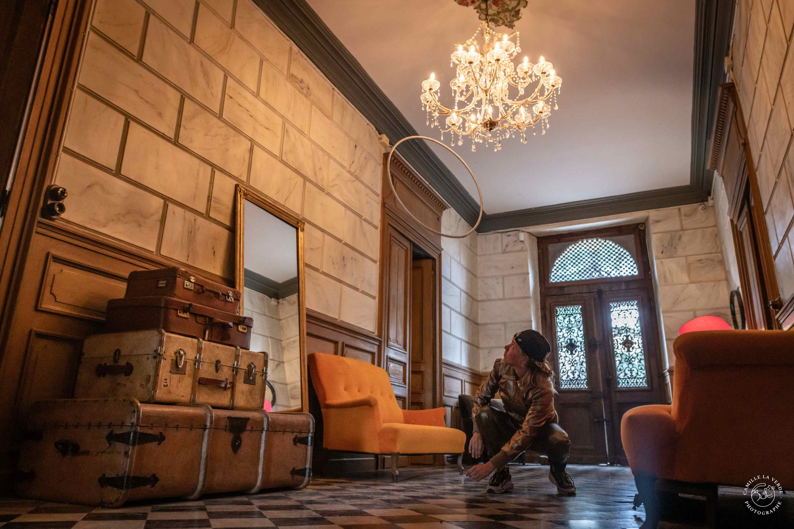
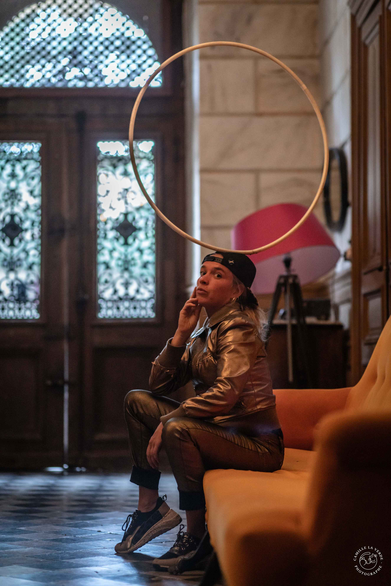
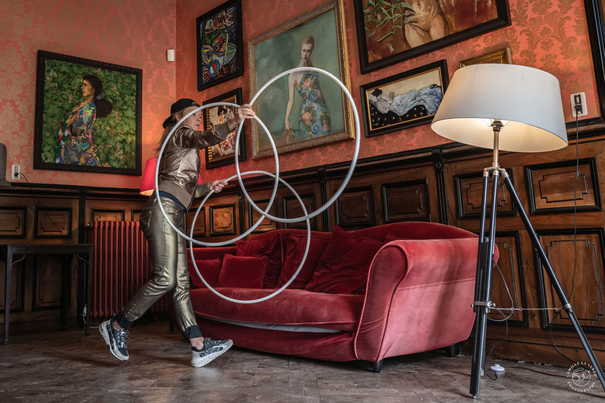
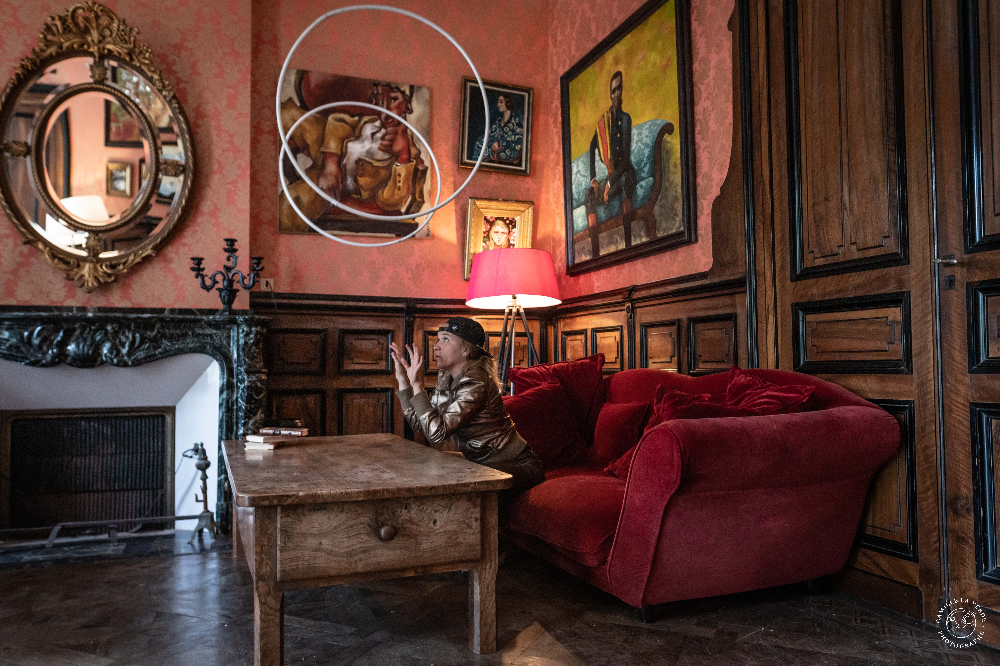
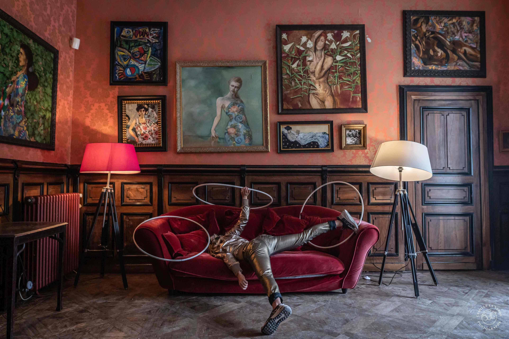


Wie können wir Raum, Körper und Timing nutzen, um uns mit Objekten zu bewegen?


## Information
Zirkus Quartier Franken e.V. präsentiert:  
**Dreitägige Hula-Hoop Entdeckungsreise mit Perrine Budan **
 
|||
|---|---|
|Datum|13.-15. November 2023|
|Zeiten|9:30 Uhr - 14:30 Uhr|
|Ort[](https://maps.app.goo.gl/NueirEDMF1TGLPVv5)|Kinder- und Jugendhaus Klüpfel Leitzstraße 10 90489 Nürnberg|
|Preis|150€ |
|Kontakt Anmeldung|workshop@zirkus-quartier-franken.de|

## Ablauf



Am ersten Tag widmen wir uns dem Raum und der Bewegung in Verbindung mit Hula-Hoop-Manipulation. Wir entdecken, wie diese Parameter zu Bewegungsimprovisation und mehr Flow führen sowie unsere Präsenz auf der Bühne positiv beeinflussen.


Wir gehen auf Entdeckungsreise im Bereich des “off Body” Hooping mit einem Hoop wie z.b. Balancen, Coinflips und Bounces, zwei Hoops (horizontal - vertical flow) und 3 Hoops (Bramson rolls etc.). Ziel ist es, neue Tricks und Variationen zu finden - mit Fokus auf Bewegung, Raum und Körper.


Zuerst wollen wir als Gruppe erforschen, welche Kreationsmöglichkeiten es gibt, wenn es mehr Personen als Hula Hoops gibt. Wie können wir uns in einer kleinen Gruppe bewegen, jonglieren oder Objekte manipulieren? Wir lernen Bewegungstechniken kennen und nutzen die Jonglage, um gemeinsam zu kreieren. In einem zweiten Teil wollen wir die Erfahrungen aus Tag 1 und 2 in kurze Solo-Sequenzen einarbeiten, die die Grundlagen der Bewegungsarbeit beinhalten.



## Voraussetzung / Level 
Du solltest mit grundlegenden Hula Hoop Tricks und Bewegungsabläufen vertraut sein und ein Gespür für das Kreieren und den Ausdruck mit dem eigenen Körper haben. 

## Perrine Budan
Artistin, Jongleurin und Clownin. Nachdem sie während ihres Studiums der Philisophie mit verschiedenen Konzepten jonglierte, begann sie 2015 mit Hula Hoop Jonglage. Perrine war Teil verschiedener Straßentheater-Companien in Frankreich und entwickelte 2020 ihr Solo Projekt [Debout Dehors](https://www.deboutdehors.com/), in welchem sie sich mit visual und physical theater, Objektmnipulation und Figurentheater beschäftigt.


  
  
  
  
  


Fotos: [© Camille La Verde](https://camillelaverde.com/)