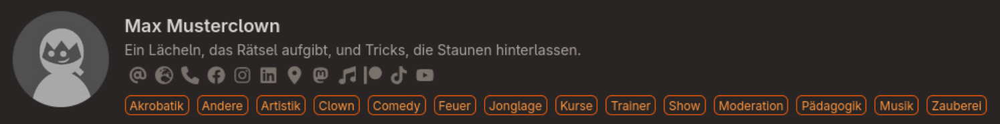

+++
# Name oder Pseudonym
title = "Max Musterclown"
# Adressleisten-Kürzel
slug =  "max_musterclown"
# Summary taucht in der Mitgliedskarte auf / Description für Suchmaschinen
description = "Ein Lächeln, das Rätsel aufgibt, und Tricks, die Staunen hinterlassen."
summary = "Ein Lächeln, das Rätsel aufgibt, und Tricks, die Staunen hinterlassen."
# Nicht zutreffende Themen löschen
network = [
    "Akrobatik",
    "Andere",
    "Artistik",
    "Clown",
    "Comedy",
    "Feuer",
    "Jonglage",
    "Kurse",
    "Trainer",
    "Show",
    "Moderation",
    "Pädagogik",
    "Musik",
    "Zauberei"
]
# Links anpassen und nicht zutreffende/gewollte entfernen
# Mindestens eine Kontaktmöglichkeit sollte vorhanden sein
social = [
    { "email" = "mailto:info@zirkus-quartier-franken.de" },
    { "globe" = "https://zirkus-quartier-franken.de" },
    { "phone" = "tel:+4912345678910111213141516171819120"},
    { "facebook" = "https://zirkus-quartier-franken.de" },
    { "instagram" = "https://zirkus-quartier-franken.de" },
    { "linkedin" = "https://zirkus-quartier-franken.de" },
    { "location-dot" = "https://zirkus-quartier-franken.de" },
    { "mastodon" = "https://zirkus-quartier-franken.de" },
    { "music" = "https://zirkus-quartier-franken.de" },
    { "patreon" = "https://zirkus-quartier-franken.de" },
    { "tiktok" = "https://zirkus-quartier-franken.de" },
    { "youtube" = "https://zirkus-quartier-franken.de" },
]
+++

Max Musterclown bewegt sich zwischen Lachen und Magie. Niemand weiß genau, woher er kommt – aber jeder erinnert sich an den Moment, wenn er wieder verschwindet.


Max ist ein fiktives Vereinsmitglied und dient ausschließlich als Beispiel dafür, wie ein Eintrag im Netzwerk aussehen kann.


Beispiel Netzwerkkarte:

## Werde Teil vom Netzwerk

Du bist Mitglied oder anderweitig mit dem Zirkus Quartier Franken e. V. verbunden und möchtest im Netzwerk sichtbar werden? Dann schreibe einfach an admin@zirkus-quartier-franken.de.
Bitte sende zur Aufnahme eine
[Anfrage]()
mit folgenden Angaben:

## Fragebogen

|Was|Beschreibung|Anzahl|
|---|---|---|
|Name|Name, Pseudonym, Gruppenname|1|
|Bild|Portrait oder Logo|1|
|Links|Homepage, Email, Telefon, Instagram, Youtube ...|1-5|
|Tags|Akrobatik, Andere, Artistik, Comedy, Feuer, Jonglage, Kurse, Trainer, Show, Moderation, Pädagogik, Musik, Zaubere|1-8|
|Beschreibung|Eine kurze Beschreibung für deine Netzwerk-Karte||
|Weiterleitung|Soll deine Karte auf etwas weiterleiten (z.B. Homepage)|0-1 Link|
|One Pager|Falls du eine eigene Seite im Netzwerk haben möchtest, bitte einen Text und evtl. Bilder bereitstellen.|

